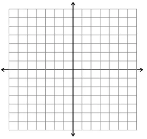
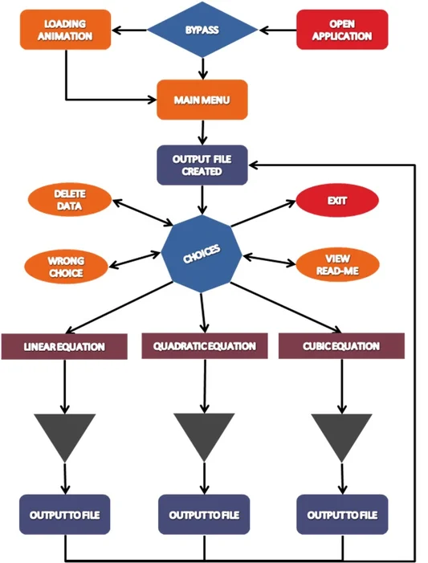
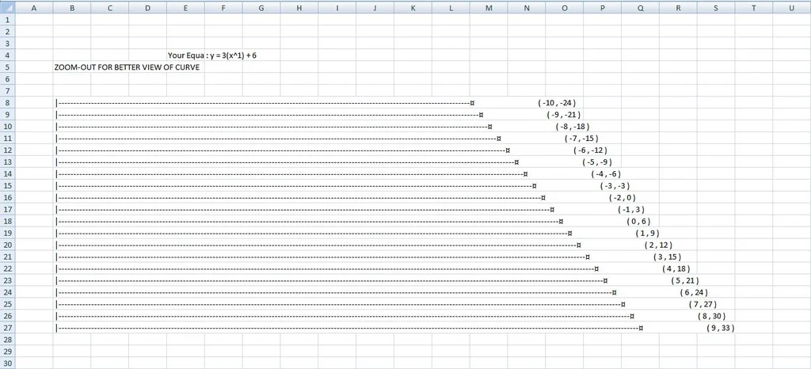
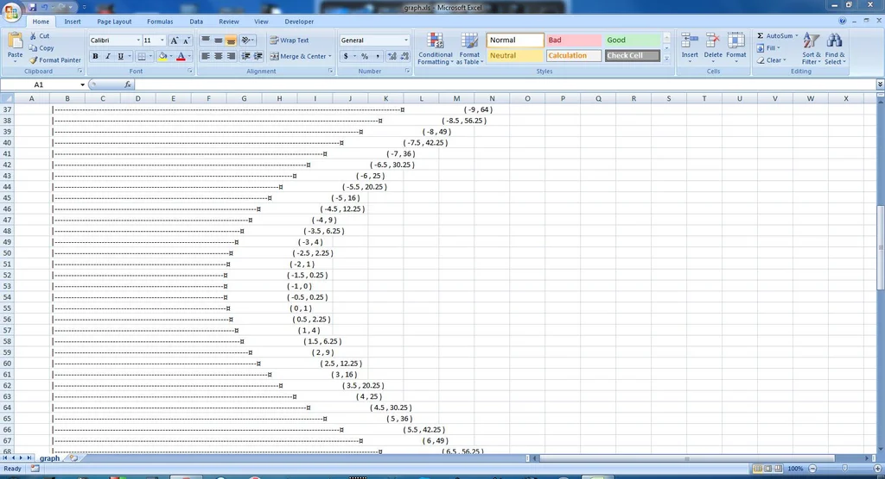
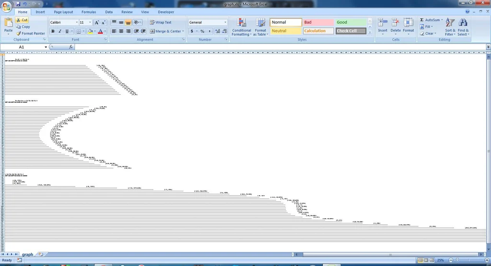
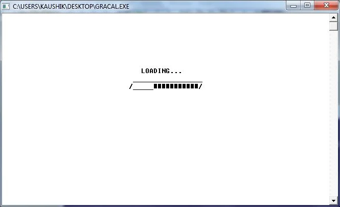
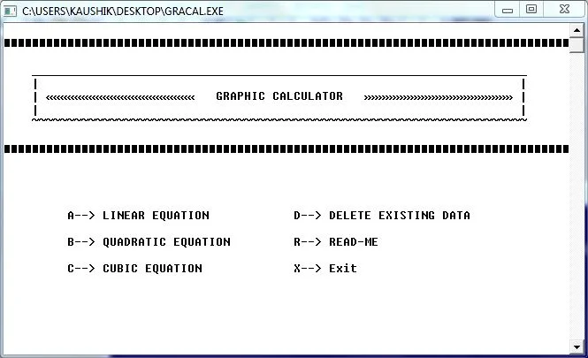

{width=100 align="left"}

The year was 2014, I had just submitted an instructable[^1] *(not acquired by Autodesk yet)* on how I cheated on my math homework. I remember working day and night to make the loading screen work. In retrospection, I had had the most fun, doing the absolutely unnecessary parts.
<!-- more -->

---

<h1><kbd> Graphic Calculator</kbd></h1>

---
## About

  

So I was in Grade 12 (until last week) and I have always had a disliking towards Graph Paper! Not that I Hate maths or René Descartes. It was just too boring to mark those points and connect them. I had to do a C++ program for my Computer Science final practical examination and was searching for an idea. Thats when i came up with THE GRAPHIC CALCULATOR[^2]. Why not give it a go?

*DISCLAIMER: No Mathematicians or Graph Paper were harmed in making of this Instructables!*

## Step 1: Materials Required

  
  

1. A Computer (in working condition)
2. C++ Compiler (can be DOSBox / Turbo C++) I used BORLAND C++ 4.5
3. Microsoft Excel / Open Office Calculator
4. Time & Patience

## Step 2: BTS - The Logic

  

The Logic is simple.

1. Get the equation from the User.
2. Loop the equation with enough values to get corresponding equation values
3. Plot Y-X Graph [Equation vs Variable]
   
The equation can be framed easily like this, for a linear equation, the general form is: ax + b = y. You get the values of 'a' and 'b' (coefficients & constants) from the user, then vary the value of variable 'x' to get the corresponding values of 'y'.

QUADRATIC: y = ax^2 + bx + c

CUBIC: y = ax^3 + bx^2 + cx + d

## Step 3: BTS - Plotting

  
  

Once we have the coordinates, we can *plot the graph* pretty easily. Now, there are several ways to do this including downloading a separate header file / creting user defined functions. The easiest way that I came p with is to use setw() function for Horizontal spacing and "\n" for vertical Spacing.

Example: for a point (13,26) i would have to use setw(13) and for (int i=0; i<26; i++) cout << "\n"
cout << "|" << setfill('-') << setw(y + 200) << "¤" << "(" << x << "," << y << ")\n";

I added another 200 spaces for the setw() so that the graph doesn't get crowsed with the axes.
setfill('-') fills the setw() sapce with the *hyphen* character. You could also use any other character.

## Step 4: BTS - Exploring Options

  

I further extended the idea to Quadratic / Cubic equations as well.Added a DELETE optio so that the previous graphs can be deleted.

This is pretty simple, just open the file in ios::open mode. But what I did was to close existing file, open in ios::trunc and close this and again open it in ios::app. This looks long but it worth doing it.

Also, I used Microsoft Excel to view my Output mainly because of three reasons. One, the output wouldn't be correct in the C++ output window (at least in my case) and secondly, Excel has much space available for plotting, it would give me much freedom to plot graphs with larger numbers. And finally, One can Zoom - IN/OUT to view the graph (curve) or the points(co-ordinates).

## Step 5: Finishing Touches

  
  

I added a short ***LOADING*** animation in the beginning. I felt it was a bit time consuming to go through the animation every time, so I added a bypass to skip the animation. And a Main Menu to wrap things up in a better way.

Pretty Printing is a great way to make your work look neater.

I've attached the code in here. So feel free to Use it / Customise it.

The loading part is too lengthly because #include isn't supported in BORLAND. Else you could use Delay(t) fdunction where 't' is the time delay given in milliseconds. (1000 ms = 1s).

Thanks for taking your time to read! Please Vote in **Data Visualization Contest!**

---

## Footnotes
[^1]: [Graphic Calculator - C++ Program](https://www.instructables.com/Graphic-Calculator-C-Program/) by [Kaushik L. S.](linkedin.com/in/thekaushikls) on instructables.com (March 2014)
[^2]: Download [**gracal.cpp**](https://content.instructables.com/FC3/1JPB/HT5CPVLB/FC31JPBHT5CPVLB.cpp) from instructables.com
