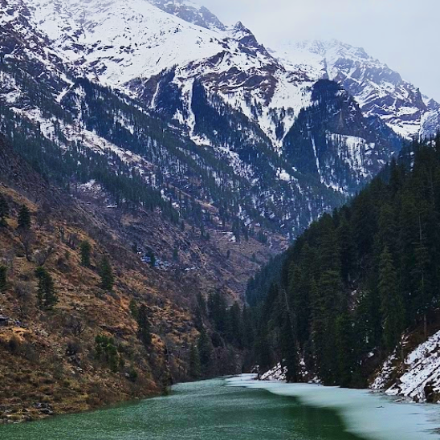

{width=80 align="left"}

Nature grounds you. It took me an entire afternoon at the Sunshine Cafe to retrospect the previous days. A poem to quickly capture the feelings, emotions, and the journey as I experienced it.

<!-- more -->
---
<h1></h1>

K H E E R G A N G A

 We wanted to see snow
 but little did we know
 we had to trek up high
 unlike the ravens who could fly

 Panting through every stride
 until our legs cried
 we reached our camp atop
 a hill, made our stop

 With us worn out from the day
 it was the perfect place to stay
 Dusk was here and snow so near
 We had food and music to hear

 Some ate, drank, and danced
 while we heated up our pants
 around the campfire, where we sat
 we also had a nice chat

 Dawn was here, and snow so near
 we started uphill with a little fear
 as rains may make it harder
 for us to venture farther

 We walked over many bridges
 even ones which were just ridges
 Water, mud, snow, and gravel
 can summarize the entire travel

 Forward we went, with our poncho
 making sure our doubts don't show
 And then came the first patch of snow
 making it all the more exciting now

 As i take another coffee sip
 and think about the trip
 I'm glad we're safe and back
 with nothing but a muddy track *(pant)*

  --- 🍀 ---

