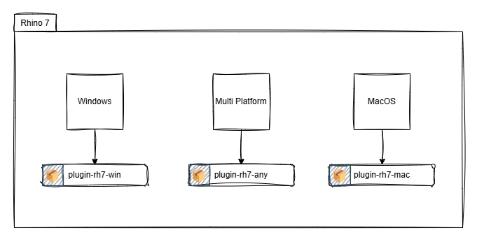
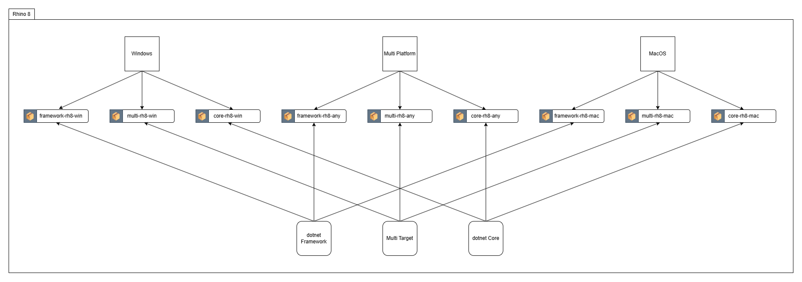
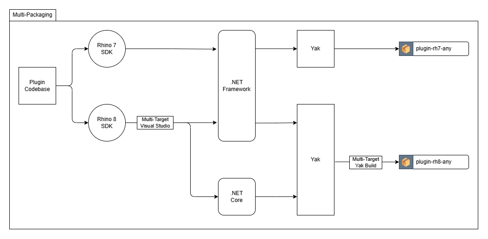

{width=80 align="left"}

Are you a developer working on a plugin for Rhino or Grasshopper? Do you intend to publish it via the Package Manager? If yes, here are some of my notes on how to approach publishing for different Rhino versions from a single codebase.

<!-- more -->
---

<h1><kbd> Multi Packaging Rhino Plugins </kbd></h1>

---
## Introduction
As Rhino moves towards implementing modern frameworks[^1] (.NET Core and later) Rhino 8 helps make that transition smooth by supporting both  .NET-Framework and .NET Core runtimes. Users can now switch between the frameworks using the `SetDotNetRuntime`[^2] command, with the default being .NET Core.

As a 3rd party plugin developer, you might be tempted to jump into .NET
Core and start leveraging the latest features. But it is a good idea to think twice, or even a couple more times. The official guide even (mostly) recommends not upgrading.

But if you're like me, here is a brief introduction to multi-packaging using Yak CLI.

## Single Target Builds
Rhino 7 supports **only** .NET Framework, which makes it easier to understand the build options provided by Yak. Plugins can target either Windows (`win`), MacOS (`mac`), or both (`any`) platform(s) using the appropriate `PLATFORM` option during the build[^3].

	
	 Fig 1: Target platforms available for Rhino 7

This targeting is especially useful when inclusion (or exclusion) of features and dependencies are necessary depending on the platform. A fairly common example would be switching UI frameworks when compiling for Windows and MacOS.

Plugins built for Rhino 7 (mostly) automatically work on Rhino 8, since .NET Framework is still supported. So in theory, you could stop reading at this point, push your plugins to Yak, and call it a day.

If you're still here...
## Multi-Targeting on Rhino 8
On Rhino 8 things get a little more interesting. One can not only choose the target `PLATFORM` but also the target `FRAMEWORK`.  This opens up a myriad of possibilities (and complexities) from the development perspective.

	
	 Fig 2: Target platforms and target frameworks available for Rhino 8

With three platform configurations and three framework configurations a total of nine different build configurations are possible. Ideally we'd have just one version to publish, one that uses .NET Core and works on both Windows and MacOS platforms.

	
	 Fig 3: <a href="https://apps.provingground.io/docs/conveyor-documentation/troubleshooting/using-conveyor-with-rhino-8/" target="_blank">Example .NET Framework error message</a>

Some users might use other plugins that do not yet support .NET Core and start Rhino 8 in `NETFramework` mode. The package manager solves this via Multi-targeting[^4] - allowing both versions to be packaged in one distribution (`.yak` file) and letting Rhino select which one to load on startup.

## Multi-Packaging
So what is the ideal setup if one wants to publish to multiple Rhino versions, multiple Platforms, and multiple Frameworks from a single codebase? Here is what I do in my workflow.

	
	 Fig 4: The Multi-Packaging workflow

This approach combines two levels of multi-targeting, firstly at the source compilation step in Visual Studio (or Visual Studio Code), and then while building the Yak package. The result is two `.yak` files that can be pushed to the (test) server for distribution.

Now that we have a process template, it can be adapted to add/remove any other dependencies, run on a CI server[^5]

Enjoy!

## Footnotes
[^1]: [Moving to .NET 7](https://developer.rhino3d.com/guides/rhinocommon/moving-to-dotnet-7/)  on developer.rhino3d.com by [Curtis-Wensley](Curtis-Wensley) and [Callum-Sykes](Callum-Sykes) (14 June 2024)
[^2]: [.NET Core vs .NET Framework](https://www.rhino3d.com/en/docs/guides/netcore/) on rhino3d.com by [Brian-Gillespie](Brian-Gillespie) (6 March 2024)
[^3]: [Yak CLI Reference](https://developer.rhino3d.com/guides/yak/yak-cli-reference/#build) on developer.rhino3d.com by [Will-Pearson](Will-Pearson) (29 October 2024)
[^4]: [The Anatomy of a Package](https://developer.rhino3d.com/guides/yak/the-anatomy-of-a-package/) on developer.rhino3d.com by [Will-Pearson](Will-Pearson) and [Callum-Sykes](Callum-Sykes) (29 October 2024)
[^5]: [Yak on a CI server](https://discourse.mcneel.com/t/yak-on-a-ci-server/130129/2) on discourse.mcneel.com by [Will-Pearson](Will-Pearson) (14 September 2021)
